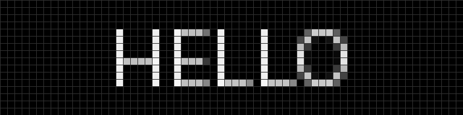
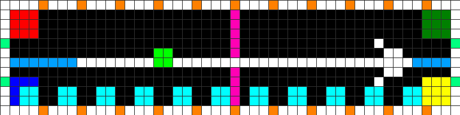
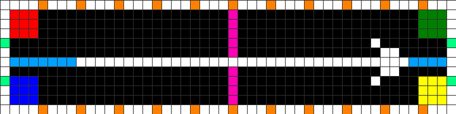
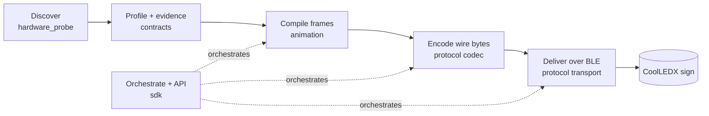

<div align="center">

# OpenSign · CoolLED

**Drive CoolLEDX Bluetooth LED signs straight from your computer — discover, render, and play text, images, and animations over BLE, with no vendor app and no guessed protocol.**

[](https://www.python.org/)
[](#project-status)
[](#whats-verified-on-hardware)
[](https://github.com/hbldh/bleak)
[](https://python-pillow.org/)



</div>

`opensign-coolled` is a Python toolkit and local HTTP API for controlling cheap "CoolLEDX" / "CoolLEDM" Bluetooth LED matrix signs — the kind normally driven only by a closed mobile app. It scans for a panel, reads its geometry and GATT layout, and then compiles and sends frames to it directly.

The design rule is **evidence before claims**: the toolkit ships with *no* hardcoded UUIDs, command bytes, or encryption keys. Everything the codec does is backed by a device profile whose every field carries a status (`unverified` → `experimental` → `verified`) and a cited source, so the tool never pretends to know more about your hardware than it has actually proven.

---

## Highlights

- **Read-only discovery** — scan advertisements (catching the name a CoolLEDX only broadcasts for a few seconds after power-on), decode geometry/colour mode from the manufacturer data, and enumerate GATT without ever writing.
- **Evidence-backed profiles** — a device profile is a museum accession card: claims advance only with cited evidence, and a codec refuses to encode a command until it is at least `experimental`.
- **Transport-neutral rendering** — text, static images, GIFs, and temporal-colour stills compile to a hashed RGB888 frame bundle that knows nothing about Bluetooth.
- **A hardware-tested CoolLEDX codec** — framing, byte-stuffing, column-major bitplane packing, 128-byte checksummed chunks, and control opcodes; plus the device's **native firmware text scroll** (proven on hardware, codec integration in progress).
- **Guarded BLE delivery** — device-agnostic chunked writes with a race-safe per-chunk ack handshake; a byte-exact dry-run plan when you don't want to touch the radio.
- **Temporal colour (FRC)** — fake in-between colours on a 1-bit panel by flickering a still faster than the eye's fusion ceiling (~62 Hz, measured on the reference panel).
- **One friendly CLI + a localhost API** — `coolled text "HELLO"` just works; the FastAPI surface exposes `/text`, `/image`, `/animation`, `/brightness`, `/power`, and `/status`.

<div align="center">

| Two-frame test animation | Alignment / orientation test pattern |
|:---:|:---:|
|  |  |

<sub>Enlarged previews from `opensign-preview` / `coolled preview` — pixel-exact to what the panel shows.</sub>

</div>

---

## Architecture

Data flows one direction, and each stage owns exactly one concern. Rendering never touches Bluetooth, only the codec knows the wire format, and only the transport touches the radio.



| Stage | Python package | Responsibility |
| --- | --- | --- |
| Discover | `opensign.hardware_probe` | Read-only BLE scan, GATT enumeration, drafts a cited profile candidate |
| Govern | `opensign.contracts` (`DeviceProfile`) | Evidence lifecycle, capability gate, and the display palette derived from the panel's colour mode |
| Compile | `opensign.animation` | Text / image / GIF / temporal-still → transport-neutral, hashed RGB888 frame bundle |
| Encode | `opensign.protocol.codecs.coolledx` | Framing, byte-stuffing, bitplanes, chunking, control opcodes, ack + pacing hints |
| Deliver | `opensign.protocol.transport` | Device-agnostic chunked writes, per-chunk ack handshake, dry-run vs. execute |
| Orchestrate | `opensign.sdk` | Panel registry, global execute gate, request tracing, artifacts, FastAPI |

---

## Install

```bash
python -m venv .venv
source .venv/bin/activate            # Windows PowerShell: .venv\Scripts\Activate.ps1
python -m pip install --upgrade pip
python -m pip install -e '.[api,dev]'
```

Python 3.11+ is required. Core dependencies are **Bleak** (BLE) and **Pillow** (rendering); **FastAPI** + **Uvicorn** are optional (`[api]` extra). The unified `coolled` command plus the focused `opensign-scan`, `opensign-preview`, `opensign-send`, and `opensign-api` entry points are installed on your `PATH`.

---

## Quickstart

Everything runs through the umbrella `coolled` command. Render/send commands **write to the panel by default** — pass `--dry-run` to build the transfer plan (and any preview) without touching Bluetooth.

### 0. Try it with no hardware

```bash
coolled preview --pattern text --text 'OPEN SIGN' \
  --width 64 --height 16 --scale 12 \
  --output out.gif
```

### 1. Find your sign (read-only)

```bash
coolled scan --names CoolLEDX CoolLEDM --timeout 10
```

Power-cycle the sign right before scanning — some panels only advertise their name for a few seconds after power-on.

### 2. Inspect it and save a profile

```bash
coolled inspect '<address-or-platform-id>' \
  --width 64 --height 16 \
  --output evidence/gatt/panel.json \
  --profile-out device_profile.local.json
```

This performs a read-only GATT enumeration and writes a profile *candidate*. No characteristic is promoted from "candidate" to active automatically — use `--select-singletons` only after reviewing the GATT evidence, and treat it as an operator decision, not protocol proof. CoolLEDX geometry is also decoded from the advertisement's manufacturer data where present.

### 3. Play something

`coolled` reads `device_profile.local.json` by default.

```bash
# Scrolling text (the firmware-native scroll where available)
coolled text "HELLO WORLD"

# Fit an image to the panel (logos/UI stay crisp with the default dither)
coolled image logo.png --auto-levels

# Play a GIF at its own frame rate
coolled gif clip.gif

# Preview the exact plan without any BLE writes
coolled text "HELLO WORLD" --dry-run --preview hello.gif
```

### 4. Ride the controls

```bash
coolled control --profile device_profile.local.json --command brightness --value 50
coolled control --profile device_profile.local.json --command power --value true
```

### 5. Serve the localhost API

The API stays **render-only** until you arm it with `--execute`.

```bash
coolled serve --profile device_profile.local.json --execute
# then, in another shell:
curl -X POST http://127.0.0.1:8124/text \
  -H 'content-type: application/json' \
  -d '{"panel_id":"desk-sign","text":"HELLO","scroll":true}'
```

---

## Command reference

`coolled <command>` is a thin umbrella over the focused entry points; use whichever you prefer.

| `coolled …` | Direct entry point | What it does |
| --- | --- | --- |
| `scan` | `opensign-scan scan` | Scan advertisements and rank CoolLED candidates (read-only) |
| `inspect <id>` | `opensign-scan inspect` | Enumerate one device's GATT and draft a profile candidate |
| `preview …` | `opensign-preview` | Render a pattern to a local `.gif`/`.png` (no hardware) |
| `text "MSG"` | — | Render text (scrolling by default) and send |
| `image <path>` | — | Fit an image to the panel and send |
| `gif <path>` | — | Render a GIF at its own frame rate and send |
| `send <bundle>` | `opensign-send bundle` | Send a prepared frame-bundle JSON |
| `control …` | `opensign-send control` | Send a control command (`brightness`, `power`, …) |
| `serve` | `opensign-api` | Run the localhost API |

Useful flags on the render/send commands: `--dry-run`, `--preview PATH`, `--bundle-out PATH`, `--rotate {0,90,180,270}`, `--flip-horizontal/--flip-vertical`, `--profile PATH`. `image` adds colour controls (`--dither`, `--temporal N`, `--auto-levels`, `--black-level`, `--white-level`); run `coolled <command> --help` for the full list.

### HTTP API

`coolled serve` (a.k.a. `opensign-api`) binds `127.0.0.1:8124` and exposes:

| Method | Path | Purpose |
| --- | --- | --- |
| `GET` | `/status` | Per-panel state, scheduled jobs, and optional diagnostics |
| `POST` | `/text` | Render + play text (static or scrolling) |
| `POST` | `/image` | Fit + play an image (static, or a temporal-colour loop) |
| `POST` | `/animation` | Compile + play a bounded GIF/APNG |
| `POST` | `/scene` | Play a scene description |
| `POST` | `/brightness` | Set brightness (0–100%) |
| `POST` | `/power` | Turn the panel on/off |

---

## What's verified on hardware

Reference panel: **CoolLEDX, 64×16, 7-colour, firmware 6** (BLE MAC `ff:00:00:06:6f:82`).

| Capability | Opcode | Status | Notes |
| --- | --- | :---: | --- |
| Brightness | `0x08` | **verified** | Brightness sweep visibly changed the panel (2026-07-13) |
| Static image | `0x03` | **verified** | 4-chunk image acked per-chunk and displayed (2026-07-13) |
| Stored animation | `0x04` | **verified** | Multi-frame clip stored, looped, and animated; pinned the 30 KiB / 80-frame buffer at 64×16 (2026-07-13) |
| Native text scroll | `0x02` | **verified** | Wide bitmap scrolled by firmware; `coolled text --speed 0..10` (2026-07-14) |
| Temporal colour (FRC) | via `0x04` | **observed** | Sub-frame loop reads as intermediate tones above the ~62 Hz fusion ceiling |
| Per-chunk ack pacing | notify | **verified** | `acks_received=4/4` on a 4-chunk frame |
| Power on/off | `0x09`/`0x13`/`0x12` | *experimental* | Reference-driver mapping; not yet isolated on this panel |
| Scroll mode | `0x06` | **verified** | `mode=left` scrolled native banner (2026-07-14); reconfirmed in speed sweep |
| Scroll speed | `0x07` | **verified** | Higher byte = faster native scroll; CLI `--speed 0..10` maps linearly to 0..255. Opposite polarity from animation `coolledx_speed` (ms/frame) |

### Still open

- Decode the notify **ack status** byte (`0x00` success vs `0x06` checksum error) and wire NAK re-send (arrival is verified; the status decode is not yet wired in).
- Route SDK/API `play_text(scroll=true)` through native scroll (CLI already does).
- Asset/hash cache to skip re-transferring a frame bundle the panel already holds; multi-panel fan-out; API auth/rate-limiting.

---

## Device profiles & the evidence model

A `device_profile.*.json` is the single source of truth every module reads from — geometry, characteristics, connection parameters, capabilities, and a `protocol` section whose commands each carry a `status` and cited `evidence`.

- **`device_profile.json`** — the checked-in *starter* profile: empty, unverified, and intentionally protocol-agnostic.
- **`device_profile.local.json`** — the profile you generate for *your* panel with `coolled inspect` (git-ignored, since it identifies your hardware).

Claims move `unverified → experimental → verified` (or `rejected`), and never skip a step: `verified` requires a live-hardware evidence entry. Codec selection is gated on this status — the runtime will happily *encode* an `experimental` claim (a controlled live test is how evidence gets promoted), while the separate `execute` flag alone decides a real BLE write vs. a byte-exact plan. See [`protocol.md`](protocol.md) for the full research ledger and promotion checklist.

---

## Safety & evidence rules

- The API listens on `127.0.0.1` and has **no built-in authentication** — never expose it without an authenticated reverse proxy and transport security.
- The `coolled` / `opensign-send` CLIs write to the panel by default; pass `--dry-run` to preview. The API server stays render-only until started with `--execute`.
- A command or frame schema must be at least `experimental` (with cited evidence) before the codec will encode it; keep unattended and API-exposed use on `verified` profiles.
- Treat captures as sensitive: never commit private keys, pairing data, device-owner identifiers, or captures containing unrelated personal traffic.
- Keep the renderer independent from Bleak and packet framing — the package boundaries and tests enforce it.

---

## Development

```bash
make test          # PYTHONPATH=src python -m pytest
make preview       # regenerate the sample two-frame preview
make install-api   # editable install with the API extra
ruff check .       # lint (config in pyproject.toml)
```

Tests cover contracts, classification, rendering, frame-bundle round trips, packet templates, chunking, scheduler behaviour, and render-only orchestration. Hardware tests are intentionally separate — they require a physical panel and reviewed evidence. The one-shot `scripts/live_*.py` and `scripts/*_experiment.py` helpers are the harness used to gather that evidence.

---

## Repository map

```text
src/opensign/
  contracts.py           Shared device / profile / frame-bundle contracts
  hardware_probe/        Discovery, GATT inspection, profile generation
  protocol/              Codec, packet framing, chunking, BLE transport, runtime
  animation/             Rendering, frame bundles, previews
  sdk/                   Registry, API, scheduler, orchestration, trace state
schema/                  JSON Schemas for the stable contracts
scripts/                 Live hardware harness + one-shot experiments
examples/generated/      Reproducible preview outputs
evidence/                Captures and provenance directories
specs/                   Internal design specs (SMDL) — a build-time design harness, not needed to run anything
docs/module-map.md       Design-directive → Python module map
protocol.md              Evidence ledger and promotion process
```

---

## Project status

Alpha, and honest about it: the discovery → render → encode → deliver path is verified end-to-end on the reference panel, but this is a research-grade tool for a reverse-engineered protocol, not a polished product. Confidence in a device profile is deliberately capped below certainty — it records what has been proven, not what is assumed. No license file is included yet; treat the code as all-rights-reserved until one is added.
