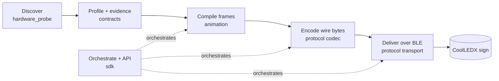

<div align="center">

# OpenSign · CoolLED

**Drive CoolLEDX / CoolLEDM Bluetooth LED signs from your computer — no vendor app, no guessed protocol.**

[](https://www.python.org/)
[](#status)
[](#verified-on-hardware)


</div>

`opensign-coolled` is a Python toolkit and localhost HTTP API for the cheap "CoolLEDX" / "CoolLEDM" Bluetooth LED matrix signs normally driven only by a closed mobile app. It scans for a panel, reads its geometry and GATT layout, then compiles and sends frames directly.

The design rule is **evidence before claims**: there are no hardcoded UUIDs, command bytes, or keys. Everything the codec does is backed by a device-profile field carrying a status (`unverified` → `experimental` → `verified`) and a cited source, so the tool never pretends to know more about your hardware than it has proven.

## Architecture

Data flows one direction: rendering never touches Bluetooth, only the codec knows the wire format, and only the transport touches the radio.



## Install

```bash
python -m venv .venv
source .venv/bin/activate            # Windows PowerShell: .venv\Scripts\Activate.ps1
python -m pip install -e '.[api,dev]'
```

Python 3.11+. Core dependencies are **Bleak** (BLE) and **Pillow** (rendering); **FastAPI** + **Uvicorn** are optional (`[api]` extra). Installs the umbrella `coolled` command plus `opensign-scan`, `opensign-preview`, `opensign-send`, and `opensign-api`.

## Quickstart

Render/send commands **write to the panel by default**. Add `--dry-run` to build the byte-exact transfer plan without touching Bluetooth; supplying `--preview PATH` also always disables delivery.

```bash
# No hardware: render a preview to a file
coolled preview --pattern text --text 'OPEN SIGN' --width 64 --height 16 --scale 12 --output out.gif

# Find your sign (read-only). Power-cycle it first: some panels advertise their name only briefly after power-on.
coolled scan --names CoolLEDX CoolLEDM --timeout 10

# Inspect it and write a profile candidate (read-only GATT enumeration)
coolled inspect '<address-or-id>' --width 64 --height 16 \
  --output evidence/gatt/panel.json --profile-out device_profile.local.json

# Play something (coolled reads device_profile.local.json by default)
coolled text "HELLO WORLD"                       # firmware-native scroll where available
coolled image logo.png --auto-levels
coolled animation clip.webp                      # aliases: anim, gif
coolled text "HELLO WORLD" --preview hello.gif        # writes the preview; does not send

# Controls
coolled control --profile device_profile.local.json --command brightness --value 50
coolled control --profile device_profile.local.json --command power --value true

# Localhost API (render-only until you arm it with --execute)
coolled serve --profile device_profile.local.json --execute
curl -X POST http://127.0.0.1:8124/text -H 'content-type: application/json' \
  -d '{"panel_id":"desk-sign","text":"HELLO","scroll":true}'
```

`coolled inspect` never promotes a characteristic automatically; `--select-singletons` is an operator decision made after reviewing the GATT evidence.

## Commands

| `coolled …` | Direct entry point | What it does |
| --- | --- | --- |
| `scan` | `opensign-scan scan` | Scan advertisements and rank CoolLED candidates (read-only) |
| `inspect <id>` | `opensign-scan inspect` | Enumerate one device's GATT and draft a profile candidate |
| `preview …` | `opensign-preview` | Render a pattern to a local `.gif`/`.png` (no hardware) |
| `text "MSG"` | — | Render text (scrolling by default) and send |
| `image <path>` | — | Fit an image to the panel and send |
| `animation <path>` | `anim`, `gif` | Render an animated GIF, WebP, APNG, or other Pillow-supported image and send |
| `send <bundle>` | `opensign-send bundle` | Send a prepared frame-bundle JSON |
| `control …` | `opensign-send control` | Send a control command (`brightness`, `power`, …) |
| `serve` | `opensign-api` | Run the localhost API |

Common render/send flags: `--dry-run`, `--preview PATH` (implies no send), `--bundle-out PATH`, `--rotate {0,90,180,270}`, `--flip-horizontal/--flip-vertical`, `--profile PATH`. Image/animation `--fit` uses standard object-fit names: `contain` keeps the whole source with padding, `cover` fills by cropping, and `fill` distorts its aspect ratio; the old name `stretch` remains an alias for `fill`. `image` adds colour controls (`--dither`, `--temporal N`, `--auto-levels`, `--black-level`, `--white-level`); `animation` adds `--key-color` / `--key-tolerance` to knock a bright background out to black. Image and animation bundles are cached by source contents, panel geometry, and rendering options; pass `--no-cache` to rebuild or `--cache-dir PATH` to choose the location. Run `coolled <command> --help` for the full list.

### HTTP API

`coolled serve` binds `127.0.0.1:8124` and exposes:

| Method | Path | Purpose |
| --- | --- | --- |
| `GET` | `/status` | Per-panel state, scheduled jobs, optional diagnostics |
| `POST` | `/text` | Render + play text (static, or a host-side scroll flipbook) |
| `POST` | `/image` | Fit + play an image (static, or a temporal-colour FRC loop via `temporal`) |
| `POST` | `/animation` | Compile + play a bounded base64 GIF/APNG (subsampled to the frame buffer) |
| `POST` | `/bundle` (alias `/scene`) | Play a pre-rendered frame-bundle JSON |
| `POST` | `/brightness` | Set brightness (0–100%) |
| `POST` | `/power` | Turn the panel on/off |

`/animation` and `/image` (`temporal`) compile server-side. The device-native firmware text scroll is CLI-only (`coolled text`); the API's `/text` uses the host-side scroll flipbook.

## Verified on hardware

Reference panel: **CoolLEDX, 64×16, 7-colour, firmware 6** (BLE MAC `ff:00:00:06:6f:82`).

| Capability | Opcode | Status | Notes |
| --- | --- | :---: | --- |
| Brightness | `0x08` | **verified** | Brightness sweep visibly changed the panel (2026-07-13) |
| Static image | `0x03` | **verified** | 4-chunk image acked per-chunk and displayed (2026-07-13) |
| Stored animation | `0x04` | **verified** | Stored/looped a clip; pinned the 30 KiB / 80-frame buffer at 64×16 (2026-07-13) |
| Native text scroll | `0x02` | **verified** | Wide bitmap scrolled by firmware; `coolled text --speed 0..10` (2026-07-14) |
| Temporal colour (FRC) | via `0x04` | **observed** | Sub-frame loop reads as intermediate tones above the ~62 Hz fusion ceiling |
| Per-chunk ack pacing | notify | **verified** | `acks_received=4/4` on a 4-chunk frame |
| Power on/off | `0x09`/`0x13`/`0x12` | *experimental* | Reference-driver mapping; not yet isolated on this panel |
| Scroll mode | `0x06` | **verified** | `mode=left` scrolled native banner (2026-07-14) |
| Scroll speed | `0x07` | **verified** | Higher byte = faster; CLI `--speed 0..10` maps linearly to 0..255 |

**Still open:** exercise the `0x06` checksum-error NAK re-send on real hardware (decoded and wired, but only `0x00` acks confirmed so far); route SDK/API `play_text(scroll=true)` through native scroll (the CLI already does); device-side asset/hash cache discovery, multi-panel fan-out, and API auth/rate-limiting.

## Profiles & the evidence model

A `device_profile.*.json` is the single source of truth every module reads — geometry, characteristics, connection parameters, and a `protocol` section whose commands each carry a `status` and cited `evidence`.

- **`device_profile.json`** — the checked-in *starter*: empty, unverified, protocol-agnostic.
- **`device_profile.local.json`** — the profile you generate for *your* panel with `coolled inspect` (git-ignored).

Claims move `unverified → experimental → verified` and never skip a step (`verified` requires a live-hardware entry). Encoding is gated on this status — the runtime will encode an `experimental` claim, since a controlled live test is how evidence gets promoted, while the separate `--execute` / `--dry-run` flag decides a real BLE write vs. a plan. Full ledger and promotion checklist: [`protocol.md`](protocol.md).

## Safety

- The API listens on `127.0.0.1` with **no built-in authentication** — never expose it without an authenticated reverse proxy.
- CLIs write to the panel by default (`--dry-run` to preview); the API stays render-only until started with `--execute`.
- A command or schema must be at least `experimental` (with cited evidence) before the codec will encode it.
- Treat captures as sensitive: never commit private keys, pairing data, device identifiers, or unrelated personal traffic.

## Development

```bash
make test          # PYTHONPATH=src python -m pytest
ruff check .       # lint (config in pyproject.toml)
make install-api   # editable install with the API extra
```

Tests cover contracts, classification, rendering, frame-bundle round trips, chunking, scheduler behaviour, and render-only orchestration. Hardware tests are intentionally separate — they need a physical panel and reviewed evidence, gathered with the one-shot `scripts/live_*.py` harness.

## Repository map

```text
src/opensign/
  contracts.py           Shared device / profile / frame-bundle contracts
  hardware_probe/        Discovery, GATT inspection, profile generation
  protocol/              Codec, packet framing, chunking, BLE transport, runtime
  animation/             Rendering, frame bundles, previews
  sdk/                   Registry, API, scheduler, orchestration, trace state
schema/                  JSON Schemas for the stable contracts
scripts/                 Live hardware harness + one-shot experiments
evidence/                Captures and provenance
specs/                   Internal design specs (SMDL) — not needed to run anything
protocol.md              Evidence ledger and promotion process
```

## Status

Alpha: the discover → render → encode → deliver path is verified end-to-end on the reference panel, but this is a research-grade tool for a reverse-engineered protocol, not a polished product. No license file is included yet — treat the code as all-rights-reserved until one is added.
